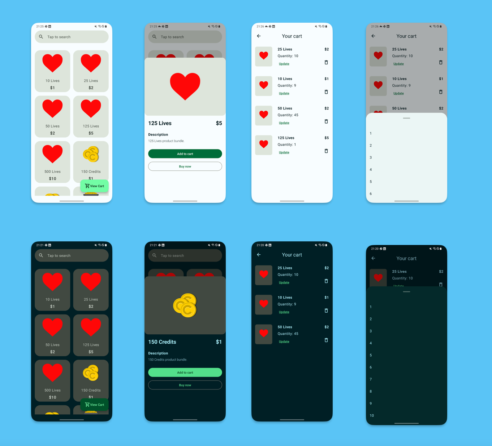
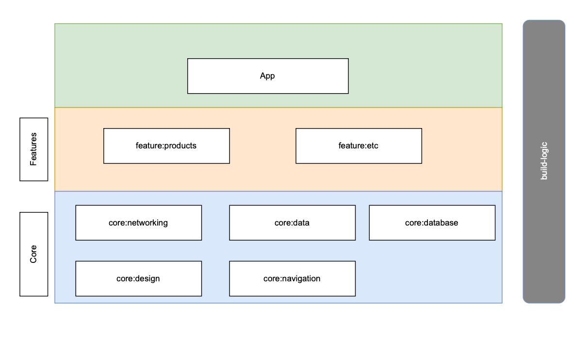

## Shoppa

Shoppa is a demo app that displays a list of products and an option to add the products to a cart.
The products can also be viewed, updated and deleted from the cart.

## Requirements:

Create a page to list all products, in the order in which they appear in the API response.

Display the following:

- Logo
- Name
- Price

Create a page to view a single product once a product has been selected from the list.

Display the following:

- Logo
- Name
- Price
- Description
- Add to Cart button
- Buy Now button

## Screenshots

## Setup

To setup and run the project, run it
on [Android Studio Giraffe](https://developer.android.com/studio) or a newer Android Version

## Architecture

The Shoppa app follows architecture as described on
[Guide to app architecture](https://developer.android.com/topic/architecture)
which is comprised of modularization and MVVM.

Below is an abstract diagram of the architecture

### App Module

The app module, depends on all, or relevant `feature modules`. Additionally, the app module can
depend directly on the `core modules`.

### Feature Modules

The feature modules, represent a singular feature of the app, such as authentication. It allows us
to decouple the features from the app itself and test these in isolation.

> It is important to note that no feature modules should ever depend on other feature modules.

### Core Modules

The core modules include code that is common amongst features, and other core modules. This includes
things such as the design system.

Features depend on core modules and core modules can depend on one another. We should be careful to
not create cyclical dependencies amongst the core modules however.
In the case of cyclical dependencies we most likely can refactor the code which is needed into a
separate core module such as `:core-common`

## Libraries and tools

Some of the libraries and tools used in the project include

- [Kotlin](https://developer.android.com/kotlin?gclid=Cj0KCQjwoK2mBhDzARIsADGbjeoMVO2Ww0zuUmtQGg8DUqVSPDWhBPGC8vGmtx1GOrh6ZpfoOFIEbKcaAoH1EALw_wcB&gclsrc=aw.ds)
  as the main language (and for testing)
- [JetPack Compose](https://developer.android.com/jetpack/compose?gclid=Cj0KCQjwoK2mBhDzARIsADGbjepwqpW6sXqc0B5GpGglo6zv7XivC252sRc1vbv5HR9Ao--GzmRNKf4aAqPFEALw_wcB&gclsrc=aw.ds)
  for UI and navigation
- [Accompanist](https://github.com/google/accompanist) : A collection of extension libraries for
  Jetpack Compose
- [Material Icons](https://developer.android.com/jetpack/compose/graphics/images/material)
- [Coil](https://coil-kt.github.io/coil/compose/) - For image loading
- [Hilt](https://developer.android.com/training/dependency-injection/hilt-android) for dependency
  injection
- [Junit](https://developer.android.com/training/testing/local-tests) - For unit testing
- [Turbine](https://github.com/cashapp/turbine) - Turbine is a small testing library for
  kotlinx.coroutines Flow
- [Kotlin Coroutines](https://kotlinlang.org/docs/coroutines-overview.html) for asynchronous and
  reactive programming
- [Room](https://developer.android.com/jetpack/androidx/releases/room) An abstraction layer over
  SQLite to allow for more robust database access while harnessing the full power of SQLite.
- [Retrofit](https://square.github.io/retrofit/) for REST networking
- [Eithernet](https://github.com/slackhq/EitherNet) A pluggable sealed API result type for modeling
  Retrofit responses.
- [Moshi](https://github.com/square/moshi) for JSON serialization and conversion
- [Okhttp](https://square.github.io/okhttp/) for network and logging
- [build logic convention](https://medium.com/@amsavarthan/unlocking-reusability-in-gradle-how-to-use-kotlin-written-convention-plugins-11b95cb008ef)
  for build management